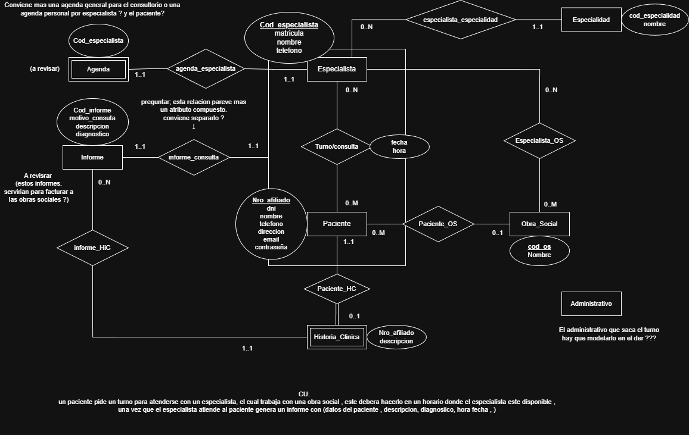

# Propuesta TP DSW

## Grupo
### Integrantes
* 48711 - Speranza, Facundo
* 50491 - Sampaulesi, Mateo
* 55366 - Cuadradas, Lucas
* 54826 - Cavestri, Elian

### Repositorios
* [frontend app](http://hyperlinkToGihubOrGitlab)
* [backend app](http://hyperlinkToGihubOrGitlab)
*Nota*: si utiliza un monorepo indicar un solo link con fullstack app.

## Tema
### Descripción

*Es un sistema de una clinica que tiene diversos especialistas de diferentes especialidades en el cual el paciente pueda gestionar su propio turno acorde a la agenda del especialista deseado, los especialistas trabajan cada uno con distintas obra sociales*

### Modelo

## Alcance Funcional 

Regularidad:
|Req|Detalle|
|:-|:-|
|CRUD simple|1. CRUD Afiliado 2. CRUD Obra_Social 3. CRUD Especialidad 4. CRUD Especialista 5. estado_turno|
|CRUD dependiente|1. CRUD Turno {depende de} paciente y de especialista  2. CRUD Agenda {depende de} CRUD especialista 3. CRUD historia_clinica {depende de} CRUD paciente|
|Listado + detalle| 1. Listado de especialistas filtrado por especialidad, muestra especialistas que tengan una determinada especialidad  2. Listado de turnos posibles filtrado por especialista, muestra horarios posibles para atenderse con un determinado especialista 3. Listado de especialistas por obra social, muestra a los especialistas que trabajan con determinada obra social|
|CUU/Epic|1. Reservar un turno con un especialista 2. El especialista realiza la consulta y genera un informe 3. El sistema a final de mes genera una factura/informe a la obra social con todos servicios prestados|
